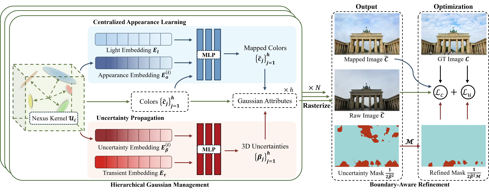

<p align="center">
<h1 align="center">NexusSplats: Efficient 3D Gaussian Splatting in the Wild</h1>
  <p align="center">
    Yuzhou Tang
    ·
    Dejun Xu
    ·
    Yongjie Hou
    ·
    Zhenzhong Wang
    ·
    Min Jiang
  </p>
  <p align="center">School of Informatics, Xiamen University</p>

[//]: # (  <h3 align="center"><a href="https://arxiv.org/pdf/2407.08447">📄 Paper</a> | <a href="https://wild-gaussians.github.io/">🌐 Project Page</a></h3>)
[//]: # (<br/>)
<p align="center">

[//]: # (  )
[//]: # (  )
</p>
<p align="justify">
we propose a nexus kernel-driven approach, called NexusSplats, for efficient and finer 3D scene reconstruction under complex lighting and occlusion conditions.
Experimental results demonstrate that NexusSplats achieves state-of-the-art rendering quality and reduces reconstruction time in different scenes by up to 70.4% compared to the current best method in quality.
</p>
<br>

[//]: # (> <b>:dizzy:	NEWS: WildGaussians is now integrated into <a href="https://nerfbaselines.github.io">NerfBaselines</a>. Checkout the results here: https://nerfbaselines.github.io/phototourism</b>)



## Installation
Clone the repository and create a `python == 3.11` Anaconda environment with CUDA toolkit 11.8 installed using
```bash
git clone git@github.com:juliantang324/NexusSplats.git
cd NexusSplats

conda create -y -n ns python=3.11
conda activate ns
conda env config vars set NERFBASELINES_BACKEND=python
pip install torch==2.0.1 torchvision==0.15.2 torchaudio==2.0.2 --index-url https://download.pytorch.org/whl/cu118
pip install --upgrade pip
pip install -r requirements.txt
pip install nerfbaselines>=1.2.0
pip install -e ./submodules/diff-gaussian-rasterization ./submodules/simple-knn
pip install -e .
```

## Interactive viewer
To start the viewer and explore the trained models, run one of the following:
```bash
# Photo Tourism
ns viewer --checkpoint https://github.com/juliantang324/NexusSplats/releases/tag/v1.0.0/phototourism.zip/trevi-fountain/checkpoint --data external://phototourism/trevi-fountain
ns viewer --checkpoint https://github.com/juliantang324/NexusSplats/releases/tag/v1.0.0/phototourism.zip/sacre-coeur/checkpoint --data external://phototourism/sacre-coeur
ns viewer --checkpoint https://github.com/juliantang324/NexusSplats/releases/tag/v1.0.0/phototourism.zip/brandenburg-gate/checkpoint --data external://phototourism/brandenburg-gate
```

## Training
To start the training on the Photo Tourism dataset, run one of following commands:
```bash
# Photo Tourism
ns train --data external://phototourism/trevi-fountain
ns train --data external://phototourism/sacre-coeur
ns train --data external://phototourism/brandenburg-gate
```

## Quantitative Comparison

<table>
  <tr>
    <th>Scene</th>
    <th colspan="3">Brandenburg Gate</th>
    <th colspan="3">Sacre Coeur</th>
    <th colspan="3">Trevi Fountain</th>
  </tr>
  <tr>
    <th>Method</th>
    <th>PSNR ↑</th>
    <th>SSIM ↑</th>
    <th>LPIPS ↓</th>
    <th>PSNR ↑</th>
    <th>SSIM ↑</th>
    <th>LPIPS ↓</th>
    <th>PSNR ↑</th>
    <th>SSIM ↑</th>
    <th>LPIPS ↓</th>
  </tr>
  <tr>
    <td>NeRF</td>
    <td>18.90</td>
    <td>0.815</td>
    <td>0.231</td>
    <td>15.60</td>
    <td>0.715</td>
    <td>0.291</td>
    <td>16.14</td>
    <td>0.600</td>
    <td>0.366</td>
  </tr>
  <tr>
    <td>NeRF-W-re</td>
    <td>24.17</td>
    <td>0.890</td>
    <td>0.167</td>
    <td>19.20</td>
    <td>0.807</td>
    <td>0.191</td>
    <td>18.97</td>
    <td>0.698</td>
    <td>0.265</td>
  </tr>
  <tr>
    <td>K-Planes</td>
    <td>25.49</td>
    <td>0.879</td>
    <td>0.224</td>
    <td>20.61</td>
    <td>0.774</td>
    <td>0.265</td>
    <td>22.67</td>
    <td>0.714</td>
    <td>0.317</td>
  </tr>
  <tr>
    <td>3DGS</td>
    <td>20.02</td>
    <td>0.882</td>
    <td>0.176</td>
    <td>17.68</td>
    <td>0.835</td>
    <td>0.204</td>
    <td>18.07</td>
    <td>0.709</td>
    <td>0.272</td>
  </tr>
  <tr>
    <td>GS-W</td>
    <td>24.32</td>
    <td>0.909</td>
    <td>0.148</td>
    <td>19.57</td>
    <td>0.826</td>
    <td>0.207</td>
    <td>20.48</td>
    <td>0.734</td>
    <td>0.252</td>
  </tr>
  <tr>
    <td>WildGauss</td>
    <td>27.23</td>
    <td>0.926</td>
    <td>0.135</td>
    <td>22.56</td>
    <td>0.859</td>
    <td>0.177</td>
    <td>23.52</td>
    <td>0.765</td>
    <td>0.228</td>
  </tr>
  <tr>
    <th>NexusSplats</th>
    <th>27.76</th>
    <td>0.922</td>
    <td>0.141</td>
    <th>23.13</th>
    <th>0.859</th>
    <th>0.174</th>
    <th>23.96</th>
    <th>0.766</th>
    <td>0.240</td>
  </tr>
</table>

The training will also generate output artifacts containing the **test set predictions**, **checkpoint**, and **tensorboard logs**.

## Rendering videos
To render a video on a trajectory (e.g., generated from the interactive viewer), run:
```bash
ns render-trajectory --checkpoint {checkpoint} --trajectory {trajectory file}
```

## Concurrent works
There are several concurrent works that also aim to extend 3DGS to handle in-the-wild scenarios:
<ul>
<li><a href="https://arxiv.org/pdf/2407.08447">WildGaussians: 3D Gaussian Splatting in the Wild</a></li>
<li><a href="https://arxiv.org/pdf/2403.15704">Gaussian in the Wild: 3D Gaussian Splatting for Unconstrained Image Collections</a></li>
</ul>

## Acknowledgements
We sincerely appreciate the authors of [3DGS] and NerfBaselines for their great work and released code. Please follow their licenses when using our code.

[//]: # (The renderer is built on [3DGS]&#40;https://github.com/graphdeco-inria/gaussian-splatting&#41; and [Mip-Splatting]&#40;https://niujinshuchong.github.io/mip-splatting/&#41;.)

[//]: # (Please follow the license of 3DGS and Mip-Splatting. We thank all the authors for their great work and released code.)

[//]: # (## Citation)

[//]: # (If you find our code or paper useful, please cite:)
[//]: # (```bibtex)

[//]: # ()
[//]: # (```)
